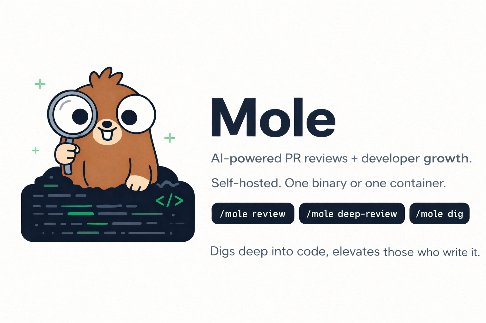

<div align="center">

  

  **AI-powered PR reviews + developer growth. Self-hosted. One binary or one container.**

  > Digs deep into code, elevates those who write it.

  <br/>

  [](https://golang.org)
  [](LICENSE)
  [](https://github.com/getkaze/mole)

  <br/>

  [What is Mole](#what-is-mole) · [Prerequisites](#prerequisites) · [Install](#install) · [Setup](#setup) · [Usage](#usage) · [How It Works](#how-it-works) · [Context Files](#context-files) · [Dashboard](#dashboard) · [Config Reference](#config-reference) · [Stack](#stack) · [Docker](#docker) · [Build](#build)

</div>

---

## What is Mole

**Mole** (the animal that digs deep, finding what others miss) is an open-source, self-hosted AI code review and developer growth platform. Install it as a GitHub App, point it at your repos, and every PR gets an automated review powered by Claude — with personality, formal issue taxonomy, quality scoring, and growth tracking.

The full loop, self-hosted:

```
Review PR → Classify issues → Track patterns → Surface insights → Grow developers
```

### PR Review Features

- **Deep reviews** — triggered automatically on PR open (Claude Opus), or manually with `/mole deep-review`
- **Standard reviews** — lighter review with `/mole review` (Claude Sonnet)
- **Ignore PRs** — skip reviews with `/mole ignore`
- **CLI reviews** — review any PR from your terminal with `mole review owner/repo#123`
- **Bot personality** — 3 modes: `mole` (playful), `formal` (professional), `minimal` (terse) — configurable server-wide or per-repo
- **Localized reviews** — full review output (issues, summary) in the configured language, not just the UI chrome
- **Issue taxonomy** — Security, Bugs, Smells, Architecture, Performance, Style (with subcategories)
- **Two severity levels** — Critical (🔴) and Attention (🟡) only — no low-value suggestions
- **Quality score** — 0-100 per PR (critical = -8, attention = -5)
- **Architecture validation** — layer enforcement rules via AST analysis
- **Security scanner** — AST-based detection of common vulnerabilities
- **Mermaid diagrams** — sequence and class diagrams in deep reviews

### Developer Growth Dashboard

- **Individual view** — issue heat map, score trends, streaks, badges
- **Team view** — issue distribution, quality trends, training suggestions
- **Module view** — health score, tech debt tracking, grouped by repository
- **Costs view** — Claude API usage and estimated costs per model (admin only)
- **Gamification** — streaks, badges, achievements
- **About page** — application info and version
- **Role-based access** — Dev, Tech Lead, Manager, Admin
- **i18n** — Portuguese (default) and English, switchable via flag selector

---

## Prerequisites

- **GitHub App** — you create one in your GitHub account (Mole runs as a GitHub App)
- **MySQL 8.0+** — stores reviews, issues, metrics
- **Valkey 7.0+** (or Redis) — job queue and webhook dedup
- **Anthropic API key** — for Claude-powered reviews

---

## Install

```bash
curl -fsSL https://getkaze.dev/mole/install.sh | sudo bash
```

Or download the binary from [Releases](https://github.com/getkaze/mole/releases) and place it in your `PATH`.

### Docker

```bash
docker pull ghcr.io/getkaze/mole:main
```

See [Docker](#docker) for full usage.

---

## Setup

### 1. Create a GitHub App

Go to [github.com/settings/apps/new](https://github.com/settings/apps/new) and create a new app:

| Setting | Value |
|---------|-------|
| Webhook URL | `https://your-server.com/webhook` |
| Webhook secret | Generate a strong secret |
| Permissions | Pull requests (read & write), Contents (read) |
| Events | Pull request, Issue comment, Installation |

Download the private key and note the App ID.

### 2. Configure

```bash
cp mole.yaml.example mole.yaml
```

Fill in your GitHub App ID, private key path, webhook secret, Anthropic API key, and database credentials. All values can be overridden with `MOLE_` prefixed environment variables.

### 3. Start

```bash
mole serve
```

Mole starts an HTTP server (default port 8080), a worker pool, and a metrics aggregator. Database migrations run automatically on startup.

---

## Usage

```bash
# Start the server + workers + dashboard
mole serve

# Run database migrations
mole migrate

# Check connectivity to MySQL, Valkey, and GitHub
mole health

# Scan a repo and generate .mole/ context files
mole init /path/to/repo
mole init /path/to/repo --language pt-BR

# Review a PR from the CLI
mole review owner/repo#123
mole review owner/repo#123 --deep
mole review owner/repo#123 --dig       # clone + explore + review
mole review owner/repo#123 --install-id 12345

# Review from local fixtures (no GitHub App needed)
mole review --local ./testdata/fixtures/01-auth-tokens/
mole review --local ./testdata/fixtures/05-cache-layer/ --deep

# Sync reactions, recalculate scores, and update metrics
mole sync

# Manage dashboard roles
mole admin set-role <user> <role>
mole admin list

# Update to latest version
mole update

# Version
mole version
```

### PR Commands

Comment on any PR to trigger Mole:

| Command | Description |
|---------|-------------|
| `/mole review` | Standard review (Claude Sonnet) |
| `/mole deep-review` | Deep review with diagrams (Claude Opus) |
| `/mole dig` | Contextual review — clones repo, explores codebase with Sonnet, reviews with Opus |
| `/mole ignore` | Skip all future reviews for this PR |

PRs are also reviewed automatically when opened.

### Reaction Sync

Developers can react to Mole's inline comments with :+1: (confirm issue) or :-1: (false positive). Mole syncs reactions automatically every hour, but you can force an immediate sync:

```bash
mole sync
```

This command:
1. Polls GitHub for reactions on recent review comments
2. Marks issues as `confirmed` or `false_positive` based on reactions
3. Recalculates PR scores excluding false positives
4. Updates developer and module metrics (false positives are no longer counted)

---

## How It Works

```
GitHub webhook ──> POST /webhook ──> Valkey queue ──> Worker pool
                   (signature check)   (dedup)        │
                                                      ├── Fetch PR diff (GitHub API)
                                                      ├── Load .mole/ context + config
                                                      ├── [/mole dig] Clone/fetch repo + worktree
                                                      ├── [/mole dig] Sonnet explores codebase (tools)
                                                      ├── Run architecture validation (AST)
                                                      ├── Run security scanner (AST)
                                                      ├── Call Claude API (review + taxonomy)
                                                      ├── Calculate quality score
                                                      ├── Apply personality + severity filter
                                                      ├── Validate line numbers against diff
                                                      ├── Post review (summary + inline comments)
                                                      ├── Save review + issues to MySQL
                                                      └── Aggregator computes metrics (hourly)
```

### Static Analysis (AST)

During `dig` reviews, Mole runs two deterministic static analysis passes using Go's `go/ast` parser (no LLM calls):

- **Architecture validation** — parses import declarations to enforce layer dependency rules (e.g. `handler` must not import `store` directly). Violations are reported as inline comments on the PR.
- **Security scanner** — walks the full syntax tree looking for dangerous patterns: SQL queries built with string concatenation, `exec.Command` with variable arguments, and hardcoded secrets (API keys, tokens). Detected issues are flagged as critical inline comments.

---

## Context Files

Create a `.mole/` directory in your repository root:

```
.mole/
  config.yaml        # personality, severity filter, architecture rules
  architecture.md    # system design, package structure
  conventions.md     # naming, error handling, patterns
  decisions.md       # ADRs, tech choices
```

Markdown files are loaded automatically and included in the review prompt. `config.yaml` controls Mole's behavior for this repo.

Generate context files automatically:

```bash
mole init /path/to/repo
mole init /path/to/repo --language pt-BR   # generate docs in Portuguese
```

---

## Dashboard

Mole includes an optional HTMX-powered dashboard for developer growth tracking. Enable it by adding dashboard config to `mole.yaml`:

```yaml
dashboard:
  github_client_id: "your-oauth-app-client-id"
  github_client_secret: "your-oauth-app-client-secret"
  session_secret: "a-random-32-char-secret"
  base_url: "http://localhost:8080"
  # Restrict access to members of a specific GitHub org (recommended)
  allowed_org: "your-github-org"
```

Create a GitHub OAuth App (separate from the GitHub App) at [github.com/settings/developers](https://github.com/settings/developers) with callback URL `http://your-server/auth/callback`.

### Development Mode

For local development without GitHub OAuth, set `server.environment: development` in your config:

```yaml
server:
  environment: development
```

The login page shows role-based test logins (Admin, Dev, Tech Lead, Manager) instead of GitHub OAuth. All logins use a fixed `testuser` / `Test User` account. See `mole.yaml.dev.example` for a minimal dev config.

### Access Control

By default, any authenticated GitHub user can log in. Set `allowed_org` to restrict access to members of a specific GitHub organization — only users who belong to that org will be allowed in.

```yaml
# Only members of "acme-corp" can access the dashboard
dashboard:
  allowed_org: "acme-corp"
```

Can also be set via the `MOLE_DASHBOARD_ALLOWED_ORG` environment variable.

### Access Roles

| Role | Own Data | Team Average | Individual Others | Modules | Costs |
|------|----------|-------------|-------------------|---------|-------|
| Dev | Yes | Yes (anonymous) | No | Yes | No |
| Tech Lead | Yes | Yes | Yes (opt-in) | Yes | No |
| Manager | No | Yes | No | Yes | No |
| Admin | Yes | Yes | Yes | Yes | Yes |

> Manager sees less than Tech Lead by design — this tool is for growth, not HR evaluation.

---

## Config Reference

```yaml
github:
  app_id: 12345                          # GitHub App ID
  private_key_path: /etc/mole/app.pem    # Path to private key
  webhook_secret: "secret"               # Webhook secret

llm:
  api_key: "sk-ant-..."                  # Anthropic API key
  review_model: "claude-sonnet-4-6"      # Standard review model
  deep_review_model: "claude-opus-4-6"   # Deep review model
  # Pricing per 1M tokens [input, output] — for the Costs dashboard
  # Defaults to Anthropic's published pricing if omitted
  pricing:
    claude-sonnet-4-6: [3.00, 15.00]
    claude-opus-4-6: [15.00, 75.00]

mysql:
  host: localhost
  port: 3306
  database: mole
  user: mole
  password: "password"

valkey:
  host: localhost
  port: 6379

server:
  port: 8080
  environment: production            # development | production

worker:
  count: 3

log:
  level: info                            # debug | info | warn | error

# Server-level defaults (overridable per-repo via .mole/config.yaml)
defaults:
  language: en                           # en, pt-BR
  personality: mole                      # mole, formal, minimal

# Codebase exploration (optional — requires git on host)
# Enables /mole dig command for contextual reviews
repos:
  base_path: "/var/lib/mole/repos"   # Where to clone repos (empty = disabled)

exploration:
  max_turns: 25                       # Max Sonnet tool-use turns
  model: "claude-sonnet-4-6"           # Exploration model

# Dashboard (optional)
dashboard:
  github_client_id: ""
  github_client_secret: ""
  session_secret: ""
  base_url: "http://localhost:8080"
  allowed_org: ""                        # Restrict to org members (leave empty to allow all)
```

Every field can be overridden with environment variables using the `MOLE_` prefix:

| Variable | Config field |
|----------|-------------|
| `MOLE_GITHUB_APP_ID` | `github.app_id` |
| `MOLE_GITHUB_PRIVATE_KEY_PATH` | `github.private_key_path` |
| `MOLE_GITHUB_WEBHOOK_SECRET` | `github.webhook_secret` |
| `MOLE_LLM_API_KEY` | `llm.api_key` |
| `MOLE_LLM_REVIEW_MODEL` | `llm.review_model` |
| `MOLE_LLM_DEEP_REVIEW_MODEL` | `llm.deep_review_model` |
| `MOLE_MYSQL_HOST` | `mysql.host` |
| `MOLE_MYSQL_PORT` | `mysql.port` |
| `MOLE_MYSQL_DATABASE` | `mysql.database` |
| `MOLE_MYSQL_USER` | `mysql.user` |
| `MOLE_MYSQL_PASSWORD` | `mysql.password` |
| `MOLE_VALKEY_HOST` | `valkey.host` |
| `MOLE_VALKEY_PORT` | `valkey.port` |
| `MOLE_SERVER_PORT` | `server.port` |
| `MOLE_SERVER_ENVIRONMENT` | `server.environment` |
| `MOLE_WORKER_COUNT` | `worker.count` |
| `MOLE_LOG_LEVEL` | `log.level` |
| `MOLE_REPOS_BASE_PATH` | `repos.base_path` |
| `MOLE_EXPLORATION_MAX_TURNS` | `exploration.max_turns` |
| `MOLE_EXPLORATION_MODEL` | `exploration.model` |
| `MOLE_DASHBOARD_GITHUB_CLIENT_ID` | `dashboard.github_client_id` |
| `MOLE_DASHBOARD_GITHUB_CLIENT_SECRET` | `dashboard.github_client_secret` |
| `MOLE_DASHBOARD_SESSION_SECRET` | `dashboard.session_secret` |
| `MOLE_DASHBOARD_BASE_URL` | `dashboard.base_url` |
| `MOLE_DASHBOARD_ALLOWED_ORG` | `dashboard.allowed_org` |
| `MOLE_DEFAULTS_LANGUAGE` | `defaults.language` |
| `MOLE_DEFAULTS_PERSONALITY` | `defaults.personality` |

---

## Endpoints

| Method | Path | Description |
|--------|------|-------------|
| `POST` | `/webhook` | GitHub webhook receiver |
| `GET` | `/health` | Health check (MySQL + Valkey status) |
| `GET` | `/metrics` | Prometheus metrics |
| `GET` | `/me` | Individual dashboard |
| `GET` | `/team` | Team dashboard |
| `GET` | `/modules` | Module dashboard |
| `GET` | `/costs` | Cost dashboard (admin only) |

---

## Stack

| Component | Technology |
|-----------|-----------|
| Language | Go 1.26 |
| Database | MySQL 8.0+ |
| Queue | Valkey 7.0+ (Redis-compatible) |
| LLM | Claude via Anthropic SDK |
| Dashboard | Go templates + HTMX |
| GitHub | go-github v72 + ghinstallation v2 |
| CLI | Cobra |
| Logging | log/slog (JSON structured) |
| Metrics | Prometheus client_golang |
| Migrations | golang-migrate (embedded SQL) |
| Container | Docker (multi-arch, GHCR) |

---

## Docker

A pre-built image is published to GHCR on every push to `main`:

```bash
docker pull ghcr.io/getkaze/mole:main
```

### Run with config file

```bash
docker run -d --name mole \
  -p 8080:8080 \
  -v /path/to/mole.yaml:/etc/mole/mole.yaml \
  -v /path/to/github-app.pem:/etc/mole/github-app.pem \
  ghcr.io/getkaze/mole:main serve --config /etc/mole/mole.yaml
```

### Run with environment variables

```bash
docker run -d --name mole \
  -p 8080:8080 \
  -v /path/to/github-app.pem:/etc/mole/github-app.pem \
  -e MOLE_GITHUB_APP_ID=12345 \
  -e MOLE_GITHUB_PRIVATE_KEY_PATH=/etc/mole/github-app.pem \
  -e MOLE_GITHUB_WEBHOOK_SECRET=secret \
  -e MOLE_LLM_API_KEY=sk-ant-... \
  -e MOLE_MYSQL_HOST=mysql \
  -e MOLE_VALKEY_HOST=valkey \
  ghcr.io/getkaze/mole:main
```

### Build locally

```bash
docker build -t mole .
```

---

## Build

```bash
make build              # current platform
make release            # cross-compile for linux/darwin amd64/arm64
make test               # run tests
make clean              # remove binaries
```

Binaries are output to `dist/` with SHA256 checksums.

---

## License

MIT — see [LICENSE](LICENSE).
